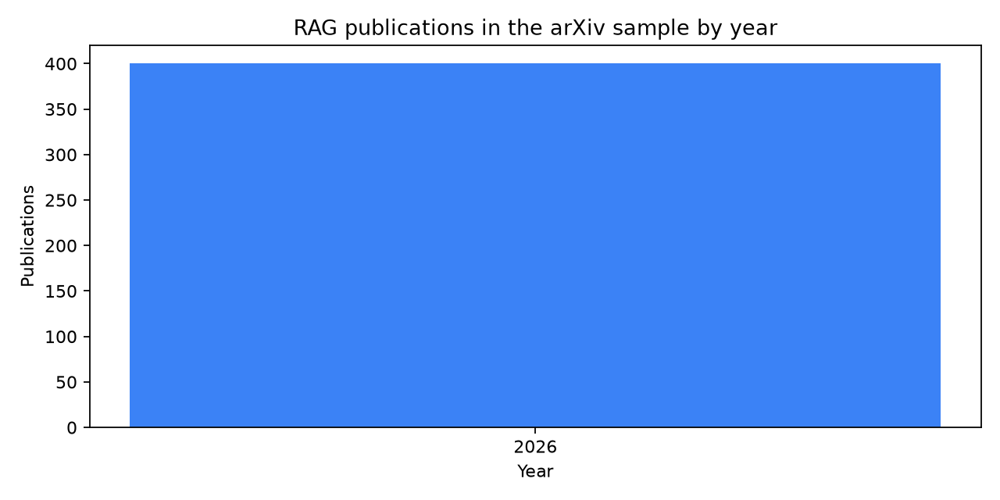
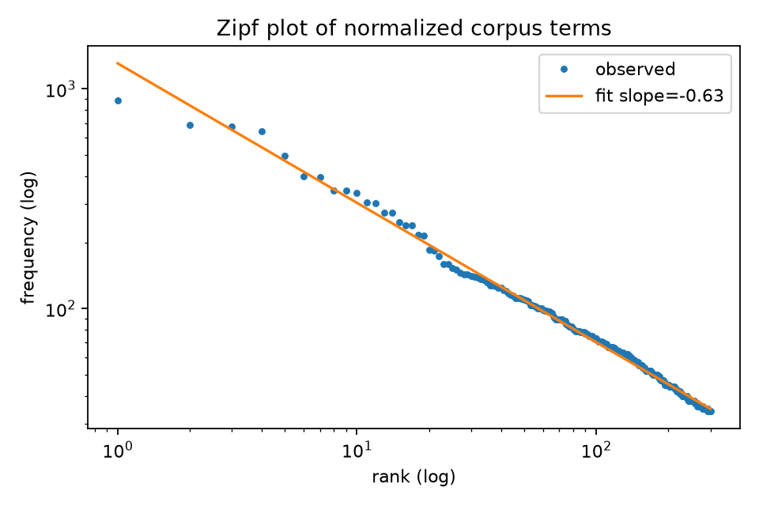
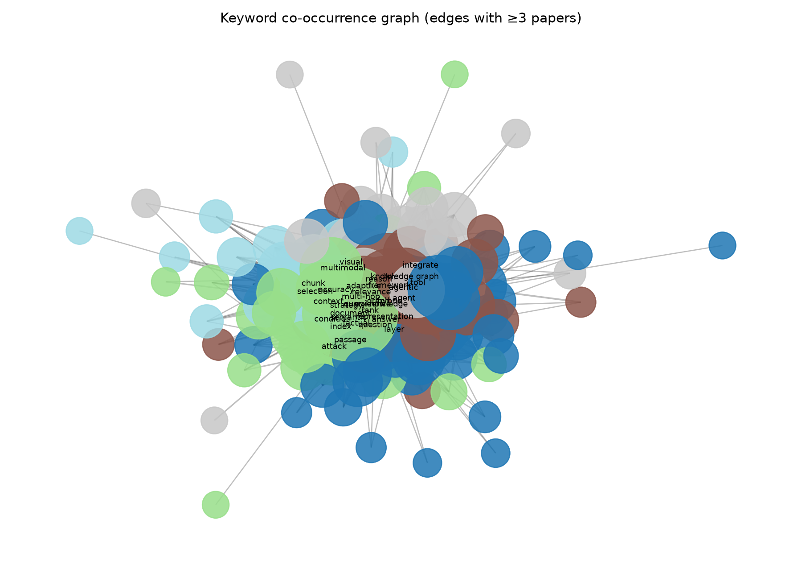

# Лабораторная работа №1
## Графовый анализ научных публикаций по теме Retrieval-Augmented Generation

**Студент:** Михайлов М.

**Дисциплина:** Анализ данных и информационный поиск

**Источник данных:** arXiv API

**Поисковый запрос:** `all:"retrieval augmented generation"`

## Цель работы

Собрать корпус публикаций по выбранной теме, выделить ключевые слова, исследовать связи между ними в графе и реализовать поиск похожих публикаций.

## Данные

В качестве темы выбрана Retrieval-Augmented Generation (RAG). Через arXiv API получены 400 уникальных публикаций. Для каждой статьи сохранены идентификатор arXiv, дата публикации, название, авторы, аннотация и категории.

В выборку вошли последние 400 результатов запроса, поэтому все статьи относятся к 2026 году. Требование задания выполнено: все публикации вышли не ранее 2020 года.

## Предобработка и разведочный анализ

Для анализа использовались названия и аннотации. Текст был приведён к нижнему регистру, служебные слова удалены, а близкие словоформы объединены. Например, `models` приведено к `model`, `documents` к `document`, а формы `retrieve`, `retrieves` и `retrieved` к `retrieval`.

После очистки в корпусе осталось 56 604 токена и 8 097 уникальных словоформ. Слова `retrieval`, `augmented`, `generation`, `rag`, `model` и `system` не участвовали в выборе ключевых слов: они встречаются почти в каждой статье из-за самого поискового запроса и не разделяют публикации по подтемам.

Ключевые слова выделялись с помощью TF-IDF. Рассматривались униграммы, биграммы и триграммы; для каждой статьи сохранялись десять терминов с наибольшим весом.

На следующем рисунке показана зависимость частоты термина от его ранга в логарифмической шкале. Наклон аппроксимирующей прямой равен −0,635. Частота терминов убывает с ростом ранга, то есть распределение соответствует ожидаемому виду для текстового корпуса. Отклонение от идеального наклона −1 объясняется узкой тематикой и очисткой текста.

## Граф ключевых слов

Вершина графа соответствует ключевому слову или фразе. Ребро проводится между терминами, если они были выбраны для одной публикации; его вес равен числу таких публикаций. Для визуализации оставлены связи с весом не менее трёх.

Полученный граф содержит 170 вершин и 2 086 взвешенных рёбер.

Сообщества найдены алгоритмом greedy modularity. Модулярность разбиения равна 0,191. Невысокое значение ожидаемо: в работах по RAG поиск, генерация, оценка качества и агентные подходы заметно пересекаются.

| Сообщество | Размер | Основные термины | Содержание |
| --- | ---: | --- | --- |
| 1 | 54 | evidence, question, answer, report, risk, support | доказательность ответа, вопросы и оценка качества |
| 2 | 41 | query, document, hybrid, latency, strategy, search | формирование запроса, документы и retrieval-пайплайн |
| 3 | 32 | knowledge, graph, llm, agent, framework, tool | knowledge graph, LLM-агенты и инструменты |
| 4 | 26 | reason, agentic, memory, state, multimodal, visual | агентное рассуждение, память и мультимодальные сценарии |
| 5 | 17 | context, accuracy, chunk, metric, token, budget | чанкинг, контекст и баланс точности со стоимостью |

## Центральность ключевых слов

Для графа рассчитаны degree centrality, betweenness centrality и eigenvector centrality. Degree centrality показывает число прямых связей термина, betweenness centrality — его роль как промежуточного узла, а eigenvector centrality учитывает важность соседних вершин.

| Термин | Degree | Betweenness | Eigenvector | Интерпретация |
| --- | ---: | ---: | ---: | --- |
| evidence | 0,639 | 0,040 | 0,299 | наиболее влиятельный термин; связан с обоснованностью ответа |
| knowledge | 0,533 | 0,021 | 0,260 | отражает роль внешних знаний и knowledge graph |
| document | 0,521 | 0,024 | 0,240 | связан с документами, источниками и индексированием |
| query | 0,568 | 0,033 | 0,233 | соединяет этап поиска с последующей генерацией |
| question | 0,497 | **0,045** | 0,229 | наиболее выраженная посредническая роль среди ведущих терминов |

Термин `evidence` имеет максимальную eigenvector centrality, а `question` — максимальную betweenness centrality среди ведущих терминов. Это показывает, что проверяемость ответа и вопрос пользователя связывают разные части RAG-пайплайна.

## Граф публикаций и поиск похожих работ

В графе публикаций вершина соответствует статье. Статьи соединяются, если у них есть общие ключевые слова; вес ребра равен числу общих терминов. Полученный граф содержит 400 вершин и 39 567 рёбер, его плотность равна 0,496. Высокая плотность объясняется тематической близостью корпуса.

Поиск похожих работ выполняется по соседям выбранной статьи. Результаты сортируются по числу общих ключевых слов.

В качестве запроса выбрана публикация `2608.16417v1`: *D2-ScaleAgent: Dual-Dimensional Scaling for Long Document Understanding*.

| Ранг | Публикация | Общих ключевых слов | Общие слова |
| ---: | --- | ---: | --- |
| 1 | *AgenticRag-R1: Agentic Reinforcement Learning with Stack Memory for Multi-Step Reasoning, Retrieval and Memorizing* | 5 | adaptive, agentic, effective, memory, reason |
| 2 | *LoongReflect: Boosting Long-Horizon Reflection in Search Agents via Global Perspective Distillation* | 4 | agent, evidence, memory, reason |
| 3 | *Agent-Enhanced Heterogeneous Graph RAG for Academic Question Answering* | 4 | agent, agentic, evidence, query |
| 4 | *WFM: Wiki Foundation Model for Complex Agentic Reasoning* | 4 | agent, agentic, memory, reason |
| 5 | *ALKEMIE Agent: an autonomous platform for computational materials design* | 3 | adaptive, agent, agentic |

Ближайшие публикации связаны с агентными RAG-системами, памятью, поиском контекста и многошаговым рассуждением. Это соответствует тематике исходной статьи.

## Вывод

В работе собран и проанализирован корпус из 400 публикаций по RAG. На основе названий и аннотаций были выделены ключевые слова, построен граф их совместной встречаемости и найдены пять тематических сообществ. Наиболее заметными терминами оказались `evidence`, `knowledge`, `document`, `query` и `question`.

Также был построен взвешенный граф публикаций. Он позволяет находить тематически близкие статьи по общим ключевым словам. Такой поиск понятен по своему критерию, но учитывает только выделенные термины; для дальнейшего развития можно сравнивать эмбеддинги аннотаций.
